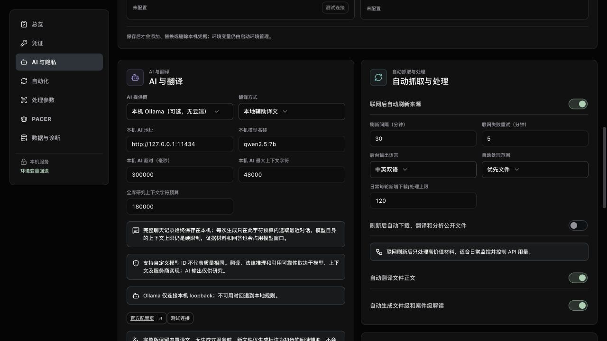
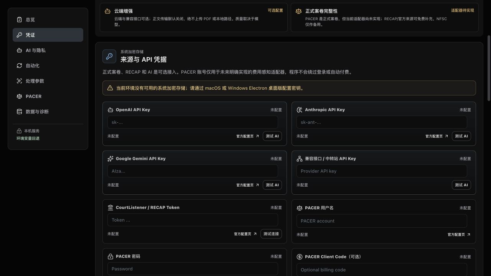
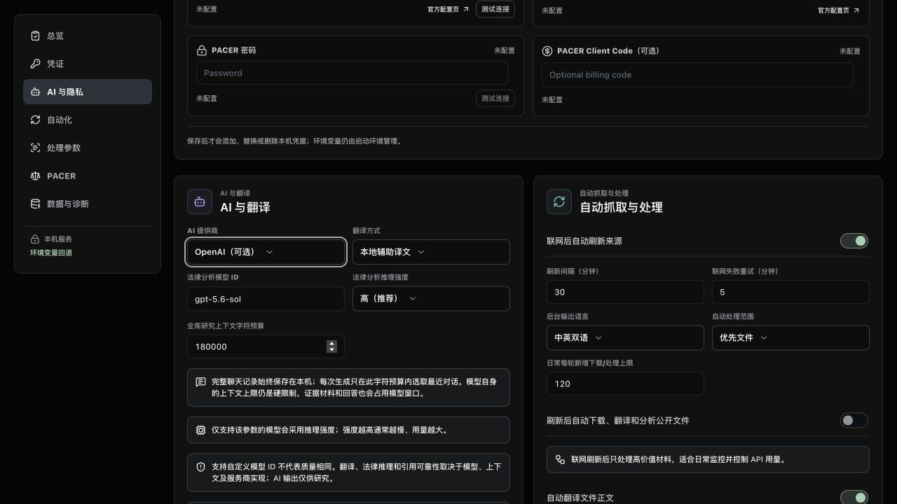
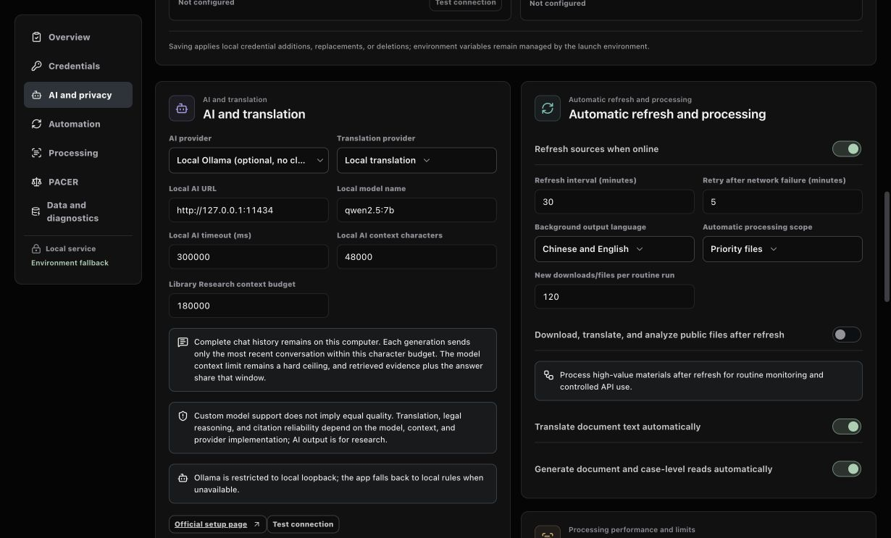
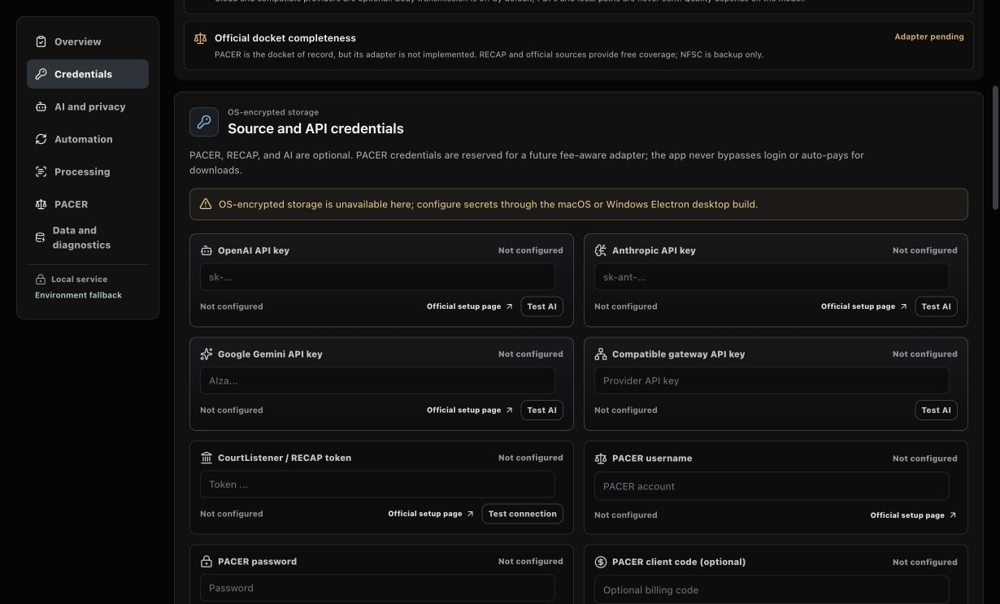
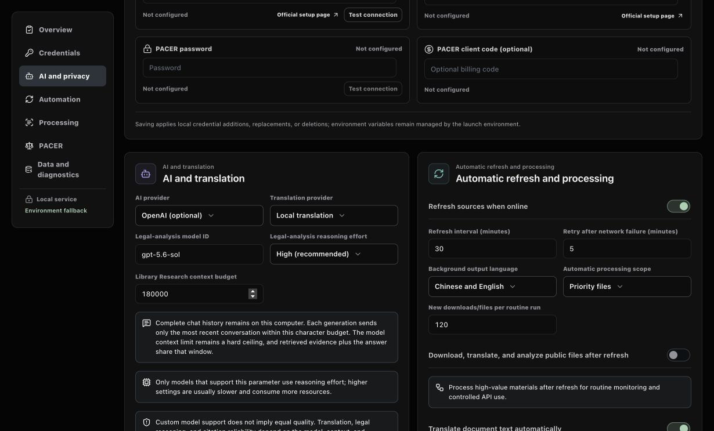

# AI 接入 / AI Setup

[**中文教程**](#中文教程) | [**English Guide**](#english-guide)

案卷观察台不要求配置 AI。没有 Ollama 或 API Key 时，“全库研究”仍可检索法院文件、案件资料、直播文字、GHOT 档案、人物公司和政策资料，但不会冒充生成式模型进行整合、联想或推理。配置模型后，翻译、文件解读和全库研究的质量、速度、上下文长度及费用取决于所选模型和服务商。

Docket Observatory does not require AI. Without Ollama or an API key, Whole-Library Research still retrieves court filings, case records, transcripts, GHOT archive material, people, companies, and policy records, but it does not pretend to perform generative synthesis or reasoning. After a model is configured, quality, speed, context length, and cost depend on that model and provider.

## 中文教程

### 方案 A：本机 Ollama，不需要 API Key

1. 从 [Ollama 官方下载页](https://ollama.com/download) 安装并启动 Ollama。只从官方网站下载安装程序。
2. 打开终端（macOS）或 PowerShell（Windows），下载一个模型。下面以设置页默认示例为例：

   ```bash
   ollama pull qwen2.5:7b
   ollama list
   ```

3. Ollama 桌面程序通常会自动启动本机服务。如果连接测试提示服务未运行，再执行 `ollama serve`；如果提示端口已被占用，通常表示服务已经在运行，不要重复启动。
4. 打开 **案卷观察台 → 设置 → AI 与隐私**。
5. 将“AI 提供商”选择为 **本机 Ollama（可选，无云端）**。地址保持 `http://127.0.0.1:11434`，模型名称必须与 `ollama list` 显示的 ID 完全一致。

<p align="center"></p>

6. 如需让 Ollama 生成新文件译文，把“翻译方式”也切换为 Ollama；只需要研究对话时可以保留内置本地辅助译文。
7. 点击页面顶部 **保存设置**，然后点击 **测试连接**。测试失败时依次检查 Ollama 是否运行、模型是否已下载、模型 ID 是否拼写一致，以及地址是否仍为本机回环地址。

模型越大通常越擅长长文、法律术语和跨文件整合，但会占用更多内存并降低速度。不要为了运行大模型而关闭系统安全功能。模型输出是研究辅助，不是正式法律意见。

### 方案 B：云端 OpenAI、Claude、Gemini 或兼容接口

1. 只在服务商官方页面创建 Key：[OpenAI](https://platform.openai.com/api-keys)、[Anthropic](https://console.anthropic.com/settings/keys)、[Google AI Studio](https://aistudio.google.com/apikey)。兼容接口的 Key 和 HTTPS 地址由该接口服务商提供，使用前应自行核实隐私政策、费用和协议兼容性。
2. 打开 **案卷观察台 → 设置 → 凭证**，把 Key 输入对应字段。截图中的字段为空且只显示格式占位符。

<p align="center"></p>

3. 进入 **AI 与隐私**，选择对应的 AI 提供商并填写该服务实际支持的模型 ID。OpenAI 仅作为下图示例；使用 Claude、Gemini 或兼容接口时选择对应项。

<p align="center"></p>

4. 如需云端翻译，再单独选择翻译服务商和模型。AI 研究与翻译可以使用不同服务。
5. **云端正文发送默认关闭。** 只有明确启用相关开关后，程序才会把允许处理的提取文字发送给所选服务。原始 PDF 和本机路径不会发送。服务商仍会收到 HTTPS 认证所需的 Key 和你允许处理的文字。
6. 点击 **保存设置**，再点击 **测试 AI** 或 **测试连接**。连接成功后再打开“全库研究”提问。

不要把 API Key 发到 GitHub Issue、邮件、聊天、截图或日志中。怀疑泄露时，应立即在服务商后台撤销旧 Key 并创建新 Key。兼容协议不代表模型质量、隐私政策或计费方式相同。

## English Guide

### Option A: local Ollama, no API key

1. Install and open Ollama from its [official download page](https://ollama.com/download).
2. In Terminal on macOS or PowerShell on Windows, download a model. This example matches the app's default model field:

   ```bash
   ollama pull qwen2.5:7b
   ollama list
   ```

3. The Ollama desktop app normally starts its local service. Run `ollama serve` only if the connection test says the service is unavailable. A port-in-use message usually means it is already running.
4. Open **Docket Observatory > Settings > AI & Privacy**.
5. Select **Local Ollama (optional, no cloud)**. Keep `http://127.0.0.1:11434` as the address and enter the exact model ID shown by `ollama list`.

<p align="center"></p>

6. Select Ollama as the translation provider too if it should generate translations for new files. Leave built-in assistive translation selected if Ollama is needed only for research chat.
7. Select **Save Settings**, then **Test Connection**. If testing fails, check that Ollama is running, the model is installed, the model ID matches exactly, and the address remains a loopback URL.

Larger models generally handle long documents, legal terminology, and cross-document synthesis better, but require more memory and run more slowly. Model output is research assistance, not formal legal advice.

### Option B: OpenAI, Claude, Gemini, or a compatible cloud endpoint

1. Create a key only on the provider's official page: [OpenAI](https://platform.openai.com/api-keys), [Anthropic](https://console.anthropic.com/settings/keys), or [Google AI Studio](https://aistudio.google.com/apikey). For an OpenAI-compatible endpoint, obtain the key and HTTPS endpoint from that provider and review its privacy and billing terms.
2. Open **Docket Observatory > Settings > Credentials** and enter the key in the matching field. The screenshot contains empty fields and format placeholders only.

<p align="center"></p>

3. Open **AI & Privacy**, choose the matching provider, and enter a model ID supported by that service. OpenAI is only the example shown below; select Claude, Gemini, or Compatible Endpoint when appropriate.

<p align="center"></p>

4. Choose a translation provider and model separately if cloud translation is required. Research and translation may use different services.
5. **Cloud text transmission is off by default.** The app sends permitted extracted text only after the relevant setting is explicitly enabled. Original PDFs and local paths are not sent. The selected provider necessarily receives the key for HTTPS authentication and the text you permit it to process.
6. Select **Save Settings**, then **Test AI** or **Test Connection**. Open Whole-Library Research after the connection succeeds.

Never put an API key in a GitHub Issue, email, chat message, screenshot, or log. If exposure is suspected, revoke the old key immediately in the provider console and create a new one. Protocol compatibility does not imply equivalent model quality, privacy terms, or billing.
