# 下载、安装 / Download And Install

[**中文安装教程**](#中文安装教程) | [**English Installation Guide**](#english-installation-guide)

> `v0.1.2` 是免费、未经商业证书签名的完整社区版。请只从本项目 GitHub Releases 下载对应系统的安装包，再按下面的系统官方流程确认运行。不要关闭 Gatekeeper、SmartScreen 或其他系统安全功能。
>
> `v0.1.2` is the free complete community build without a commercial code-signing identity. Download only the installer for your operating system from this project's GitHub Release, then use the operating system's documented confirmation flow below. Do not disable Gatekeeper, SmartScreen, or other system security controls.

## 中文安装教程

### 1. 下载正确的安装包

1. 打开 [GitHub 最新版本页面](https://github.com/Dysen177/docket-observatory/releases/latest)。
2. 向下找到 `Assets`，根据电脑选择：
   - Apple 芯片 Mac（Apple silicon）：`Docket-Observatory-0.1.2-macOS-arm64-unsigned.dmg`
   - Intel Mac：`Docket-Observatory-0.1.2-macOS-x64-unsigned.dmg`
   - Windows 10/11 x64：`Docket-Observatory-0.1.2-Windows-x64-unsigned.exe`
3. GitHub 自动生成的 `Source code (zip)` 和 `Source code (tar.gz)` 是源码，不是内置完整资料库的安装包。

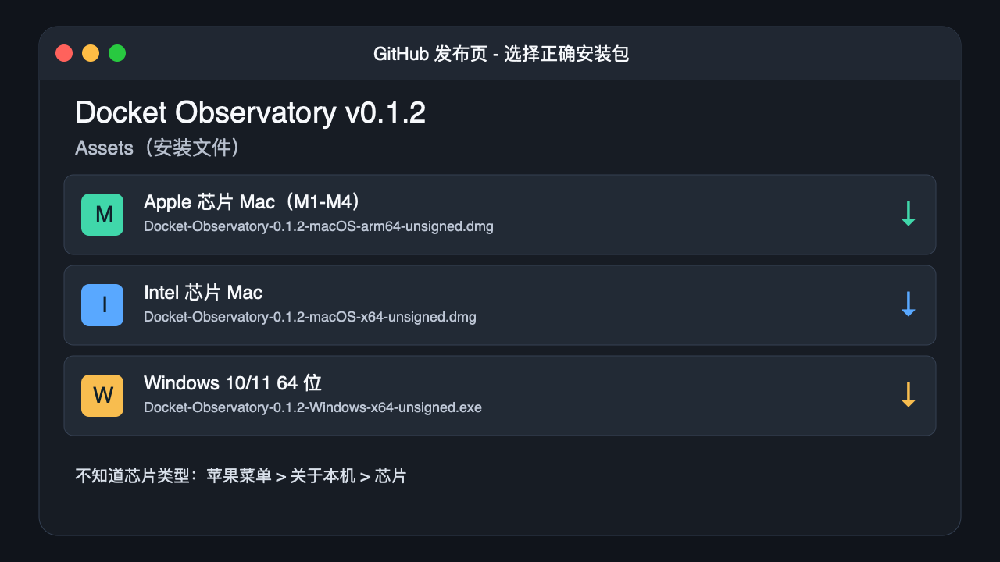

不知道 Mac 是哪种芯片：打开屏幕左上角 **苹果菜单 → 关于本机**，查看“芯片”或“处理器”。

### 2. macOS：把应用拖入“应用程序”

1. 双击下载的 DMG。
2. 把“案卷观察台”图标拖到“应用程序”文件夹。
3. 等待复制完成，再从 Finder 的“应用程序”中打开，不要长期从 DMG 窗口里运行。

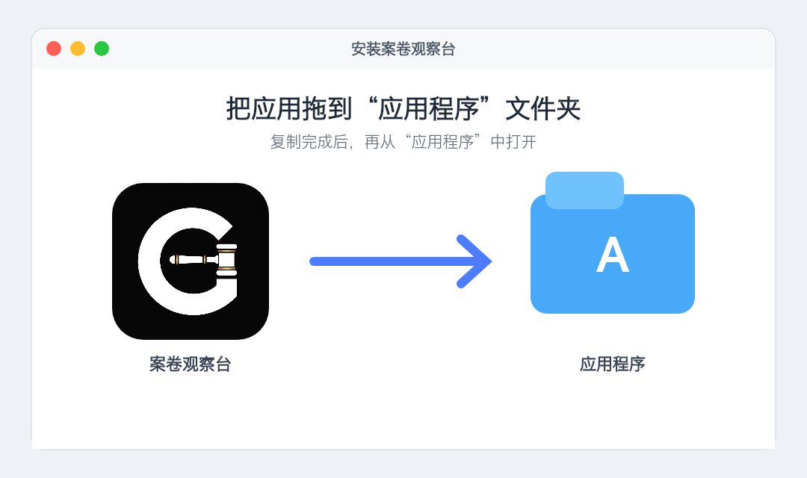

### 3. macOS：首次打开时先点“完成”

首次双击应用时，macOS 可能显示“Apple 无法验证”。这表示当前社区版没有 Apple Developer ID 和公证，不是“程序已经被 Apple 证实包含恶意软件”。

先点 **完成**，不要点“移到废纸篓”。Apple 官方图中使用“示例 App”，实际安装时会显示“案卷观察台”。

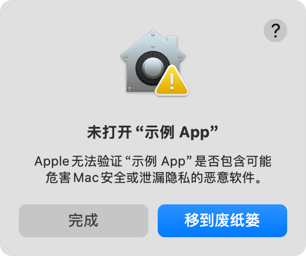

### 4. macOS：进入“隐私与安全性”

1. 打开 **系统设置**。
2. 点击 **隐私与安全性**。
3. 向下滚动到“安全性”区域。
4. 找到“已阻止‘案卷观察台’以保护 Mac”，点击 **仍要打开**。

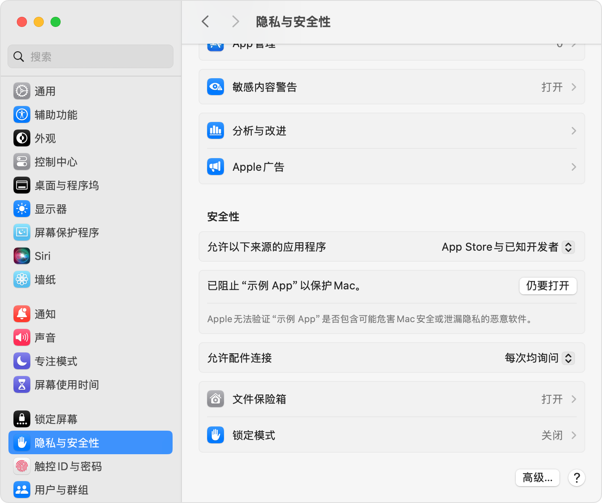

如果没有“仍要打开”：先回到“应用程序”再尝试打开一次，然后立即回到这个页面。该按钮只会在尝试运行被阻止的应用后显示一段时间。

### 5. macOS：用 Touch ID 或登录密码授权

点击“仍要打开”后，macOS 可能要求管理员授权。两种方式二选一：

| 带 Touch ID 的 Mac | 使用登录密码 |
| --- | --- |
| 将手指放在 Touch ID 传感器上。 | 输入当前 Mac 账户的登录密码，不是 Apple 账户密码。 |
| 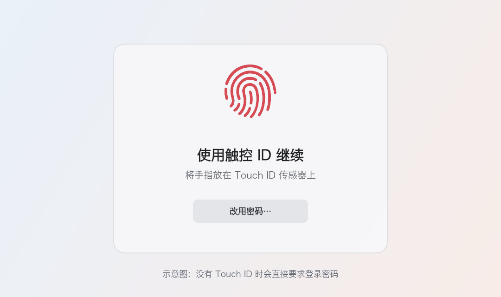 | 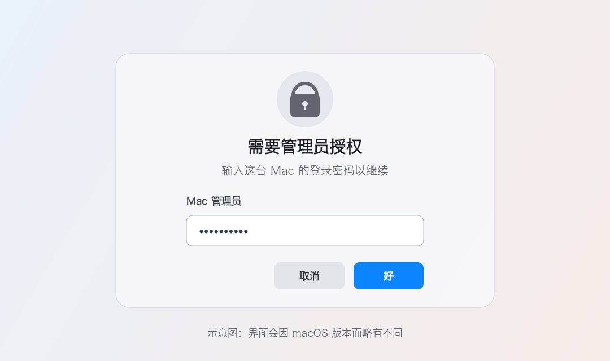 |

> 上面两张是无个人信息的流程示意图。实际样式会因 macOS 版本、Mac 型号和是否启用 Touch ID 而不同。

### 6. macOS：在最后确认框点“仍要打开”

授权后会再出现一次最终确认。核对应用名称是“案卷观察台”，然后点 **仍要打开**。下图只保留了实际提示框，没有桌面、文件、菜单栏或 Dock。

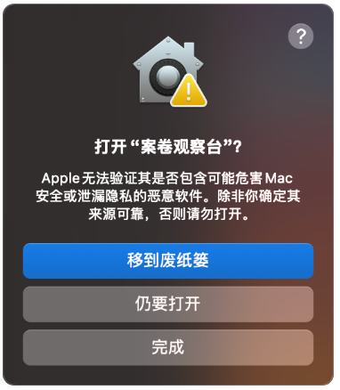

完成一次例外确认后，后续通常可以像其他应用一样从“应用程序”或 Launchpad 打开。

### 7. Windows：运行安装程序

1. 双击 `Docket-Observatory-0.1.2-Windows-x64-unsigned.exe`。
2. 如果 SmartScreen 显示“Windows 已保护你的电脑”，先点 **更多信息**，核对应用名和文件来源后再点 **仍要运行**。

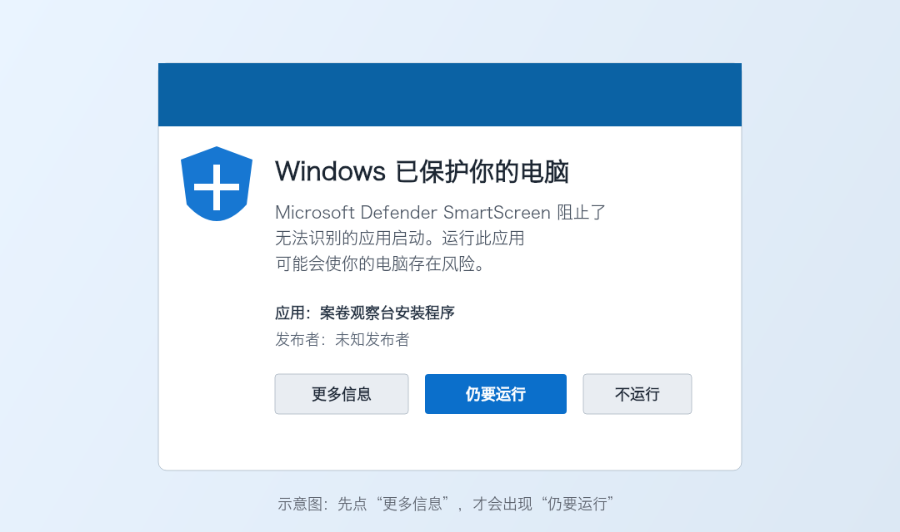

3. 安装向导允许用户选择安装位置。普通用户保留默认路径后点 **安装** 即可。

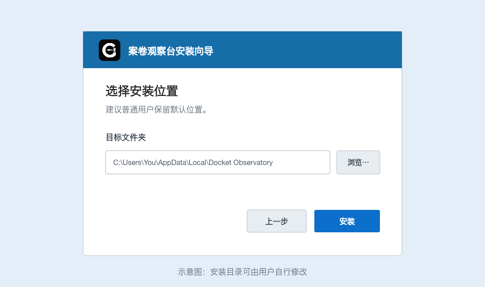

4. 如果 Windows 显示“用户账户控制”，先确认文件来自本项目 GitHub Release，再选择 **是**。默认的当前用户安装可能不会出现这一步。

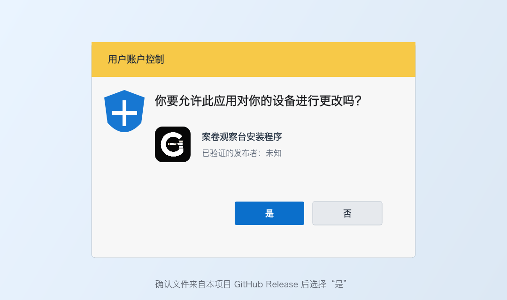

5. 安装完成后点 **完成**，从开始菜单或桌面快捷方式打开。

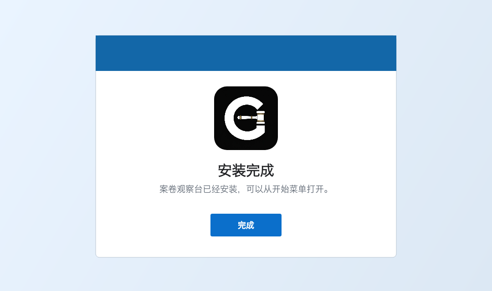

### 为什么安装包很大

完整版不是空资料库。`v0.1.2` 发布基线包含 1,897 份有效法院、机构和历史公开 PDF（约 1.61 GB），以及约 0.77 GB 的正文提取、现有译文与阅读辅助、文件解读、案件整体解读、直播文字、关系数据和全文索引。Electron、OCR 语言模型和运行依赖还会增加体积；建议至少预留 6 GB 空间。

### 常见问题

- **显示“应用已损坏”：** 不要继续使用早期下载的 macOS 安装包。删除旧 DMG，从 GitHub Release 重新下载当前版本，并确认下载链接来自本项目官方仓库。
- **只看到“移到废纸篓”：** 先点“完成”，然后按本文进入“隐私与安全性”。
- **没有 Touch ID：** 选择“改用密码”，输入 Mac 登录密码。
- **Windows 没有显示 SmartScreen 或 UAC：** 不是故障，Windows 版本、安全策略和安装方式不同时，某些确认步骤可能不出现。

## English Installation Guide

### 1. Download the correct installer

1. Open the [latest GitHub Release](https://github.com/Dysen177/docket-observatory/releases/latest).
2. Under `Assets`, choose:
   - Apple-silicon Mac: `Docket-Observatory-0.1.2-macOS-arm64-unsigned.dmg`
   - Intel-based Mac: `Docket-Observatory-0.1.2-macOS-x64-unsigned.dmg`
   - Windows 10/11 x64: `Docket-Observatory-0.1.2-Windows-x64-unsigned.exe`
3. GitHub's automatically generated source-code archives are not the complete application bundle.

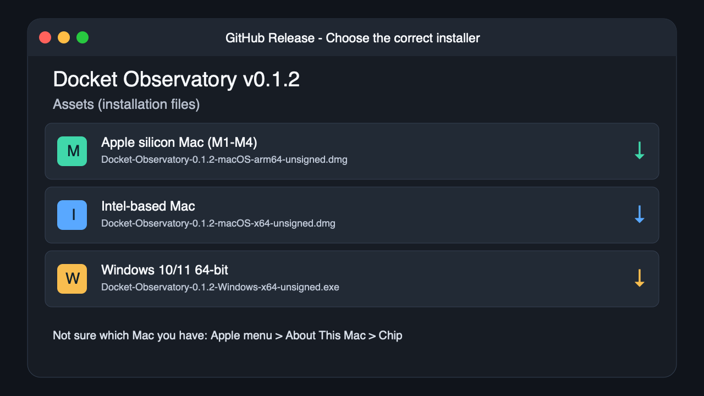

To identify your Mac, open **Apple menu > About This Mac** and check **Chip** or **Processor**.

### 2. macOS: drag the application into Applications

1. Double-click the downloaded DMG.
2. Drag Docket Observatory into the Applications folder.
3. Wait for copying to finish, then open the app from Finder's Applications folder instead of continuing to run it from the DMG window.

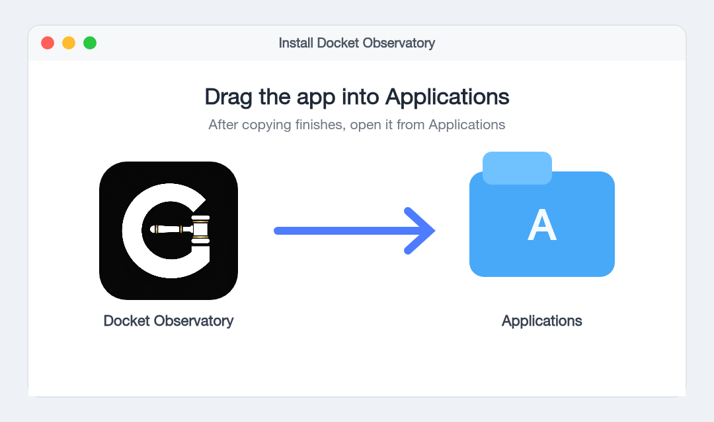

### 3. macOS: select Done on the first alert

On first launch, macOS can display an alert that Apple could not verify the app. This means the free community build has no Apple Developer ID and notarization. It does not mean that Apple has confirmed the application contains malware.

Select **Done**, not **Move to Trash**. Apple's official screenshot uses "Example App"; the actual alert names Docket Observatory.

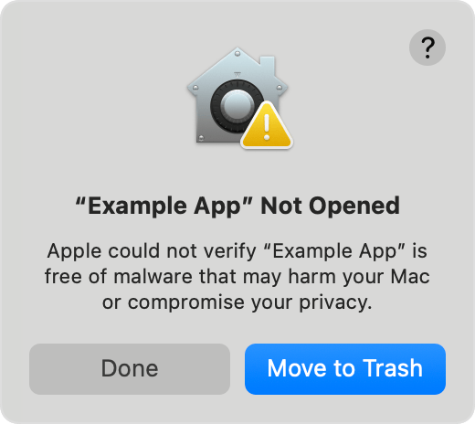

### 4. macOS: use Privacy & Security

1. Open **System Settings**.
2. Select **Privacy & Security**.
3. Scroll down to the Security section.
4. Find the message that Docket Observatory was blocked and select **Open Anyway**.

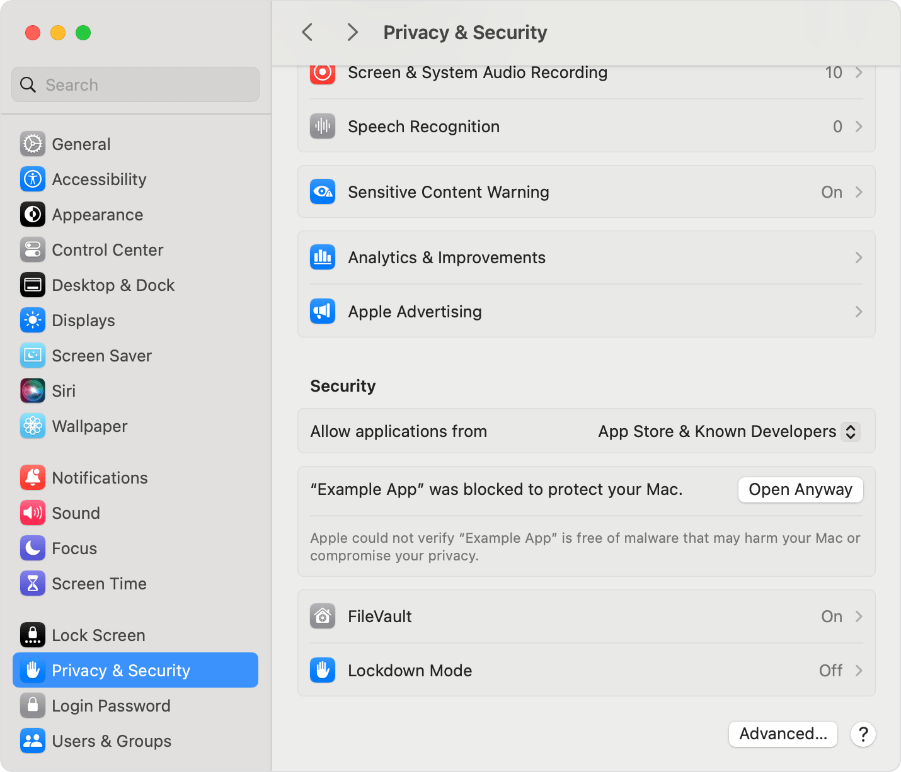

If Open Anyway is missing, try to launch the app from Applications once more and immediately return to this page. macOS shows this option only for a limited time after a blocked launch attempt.

### 5. macOS: authorize with Touch ID or the Mac login password

macOS can request administrator authorization after you select Open Anyway. Use either method offered by your Mac:

| Mac with Touch ID | Mac login password |
| --- | --- |
| Place your finger on the Touch ID sensor. | Enter the current Mac account's login password, not an Apple Account password. |
| 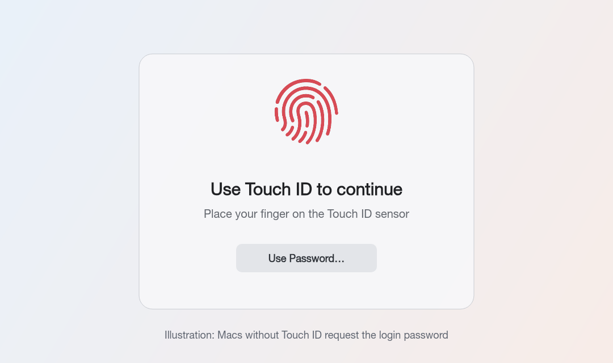 | 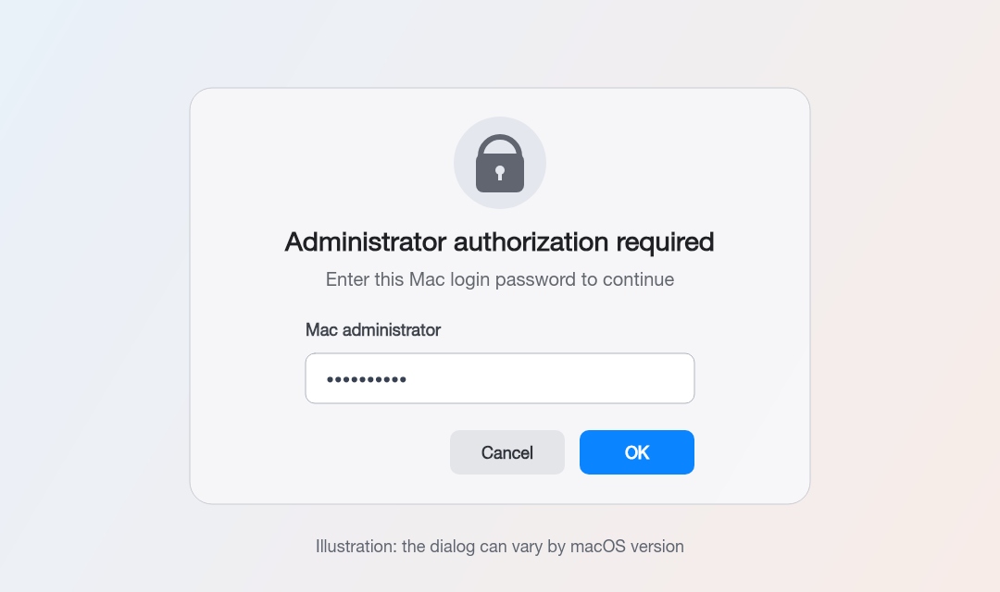 |

> These two images are privacy-safe workflow illustrations. The actual prompt varies by macOS version, Mac model, and Touch ID availability.

### 6. macOS: confirm the final prompt

After authorization, macOS asks one final time. Confirm that the app name is Docket Observatory and select **Open Anyway** or **Open**, depending on the macOS version.

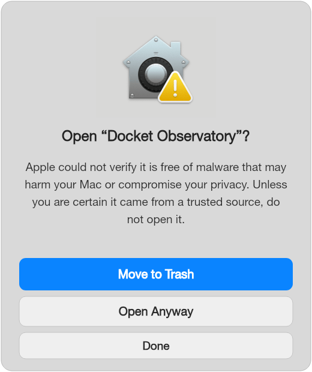

The image above is a clean English illustration of the final confirmation layout. Once this exception is approved, later launches normally work from Applications or Launchpad without repeating the entire flow.

### 7. Windows: run the installer

1. Double-click `Docket-Observatory-0.1.2-Windows-x64-unsigned.exe`.
2. If SmartScreen displays **Windows protected your PC**, select **More info**, verify the application name and download source, and then select **Run anyway**.

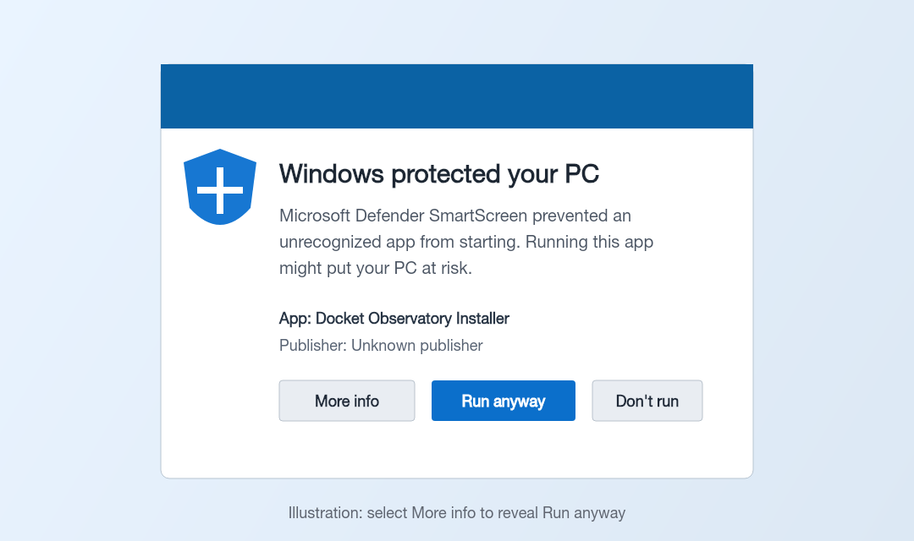

3. The assisted installer allows you to choose an installation folder. Most users can keep the default and select **Install**.

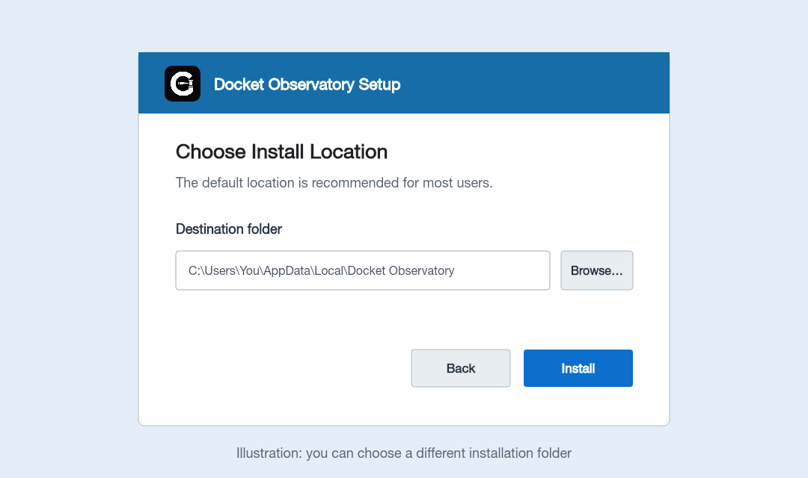

4. If User Account Control appears, verify that the file came from this project's GitHub Release and select **Yes**. A default per-user installation might not display this step.

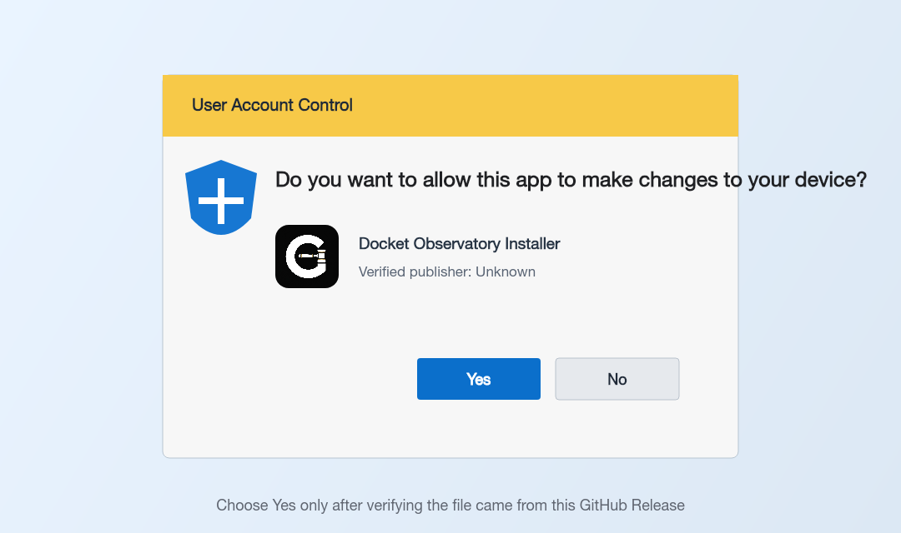

5. Select **Finish** when installation completes, then open the app from Start or the desktop shortcut.

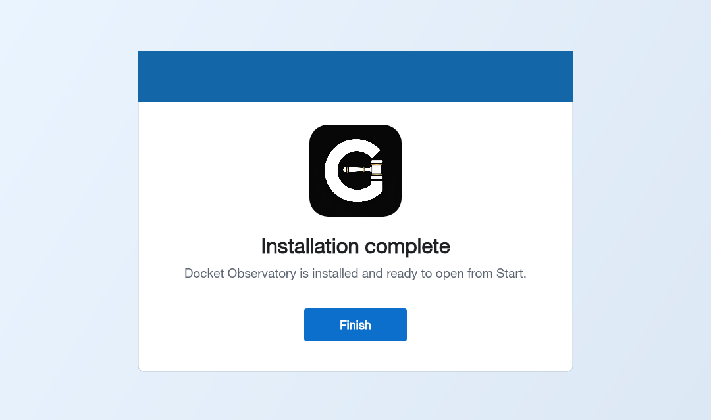

### Why the installers are large

The complete edition is not an empty library. The `v0.1.2` baseline contains 1,897 valid public court, agency, and historical PDFs (about 1.61 GB), plus about 0.77 GB of extracted text, existing translations and reading assistance, document-level readings, case dossiers, transcripts, relationship data, and full-text indexes. Electron, OCR language models, and runtime dependencies add more; keep at least 6 GB free.

### Troubleshooting

- **macOS says the app is damaged:** Do not continue using an early macOS asset. Delete the old DMG and download the current installer from this project's official GitHub Release.
- **The first alert only offers Move to Trash:** Select Done, then follow the Privacy & Security steps above.
- **No Touch ID:** Select Use Password and enter the Mac login password.
- **No SmartScreen or UAC prompt:** This is not an error. Windows version, security policy, and installation scope can change which confirmation steps appear.

## Image Sources And Privacy

- The four files ending in `-apple.png` are unmodified interface screenshots from Apple's [Chinese](https://support.apple.com/zh-cn/102445) and [English](https://support.apple.com/en-us/102445) "Safely open apps on your Mac" documentation. Apple uses the generic name "Example App."
- `macos-open-anyway-confirm-zh.png` is tightly cropped from the project's real Chinese confirmation prompt. It contains no desktop, menu bar, Dock, wallpaper, filenames, account name, or other applications.
- Password, Touch ID, DMG, GitHub, Windows, and the English final-confirmation images are documentation illustrations created without real user accounts or device data. They are labeled as illustrations where exact operating-system appearance can vary.
- Apple, macOS, Touch ID, Microsoft, Windows, Defender, and SmartScreen are trademarks of their respective owners. Their screenshots and names are used only to explain the installation workflow.

## Security Notes

- The macOS application uses identity-free ad-hoc resource signing so the bundle's internal structure can be verified. It does not have Apple Developer ID notarization.
- The Windows executable does not have a commercial Authenticode certificate.
- A future formally signed distribution tier, if offered, will use different filenames and verification rules.
- Download only from this project's GitHub Releases, not from repackaged mirrors, chat attachments, or unknown file-sharing sites.
- See the [Code Signing Policy](CODE_SIGNING_POLICY.md), [Security Policy](SECURITY.md), and [Chinese Security Policy](SECURITY.zh-CN.md).
