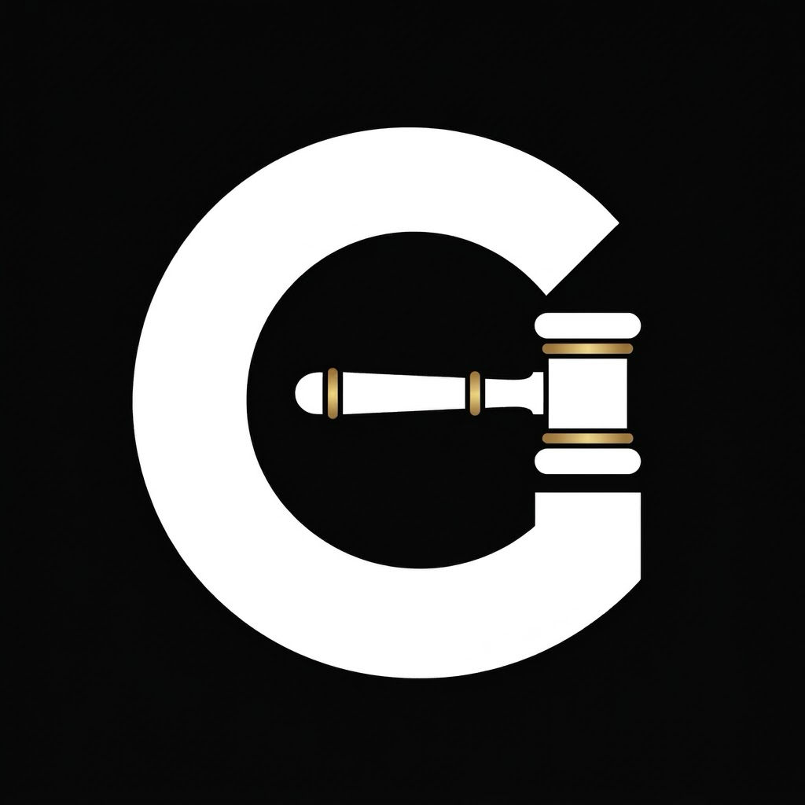
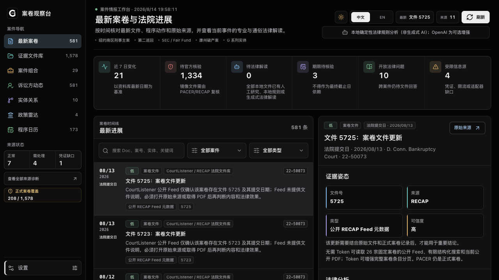
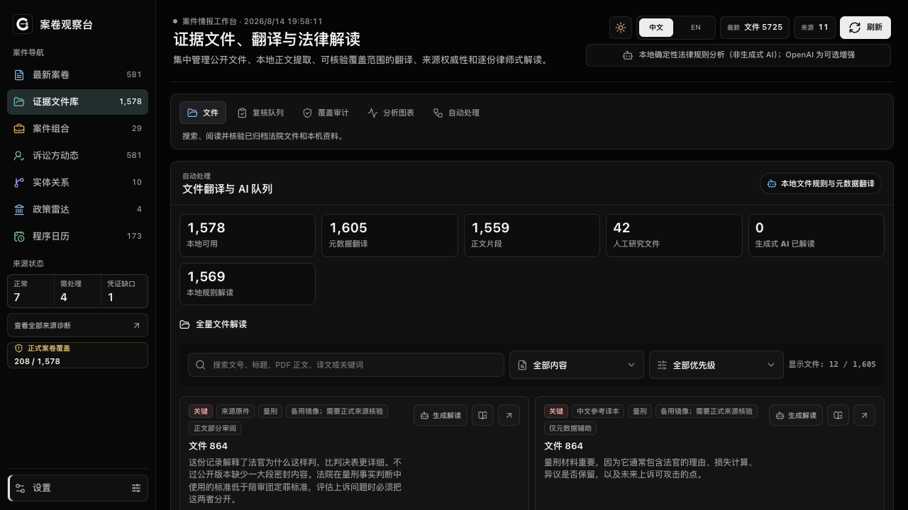
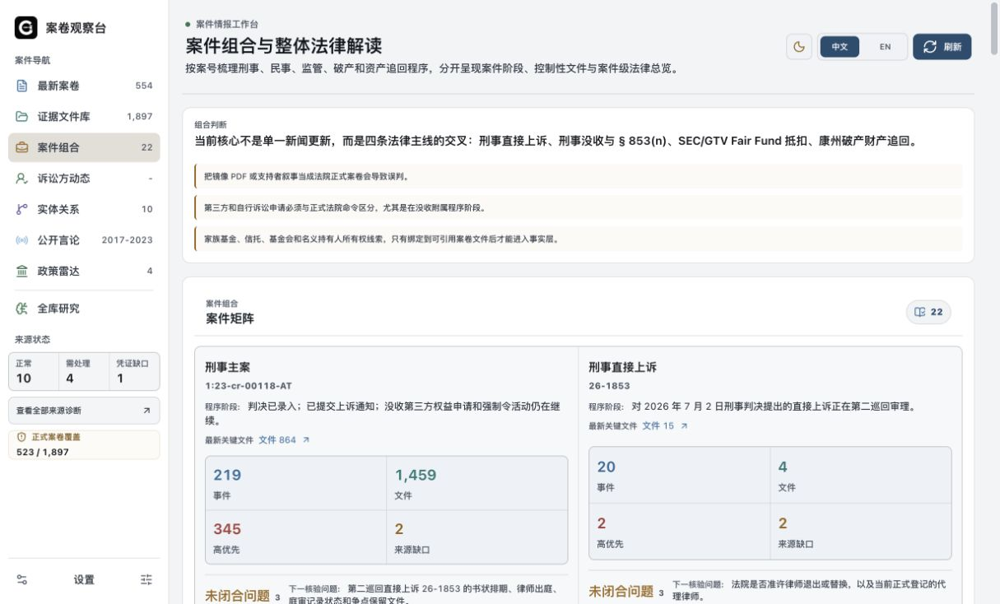
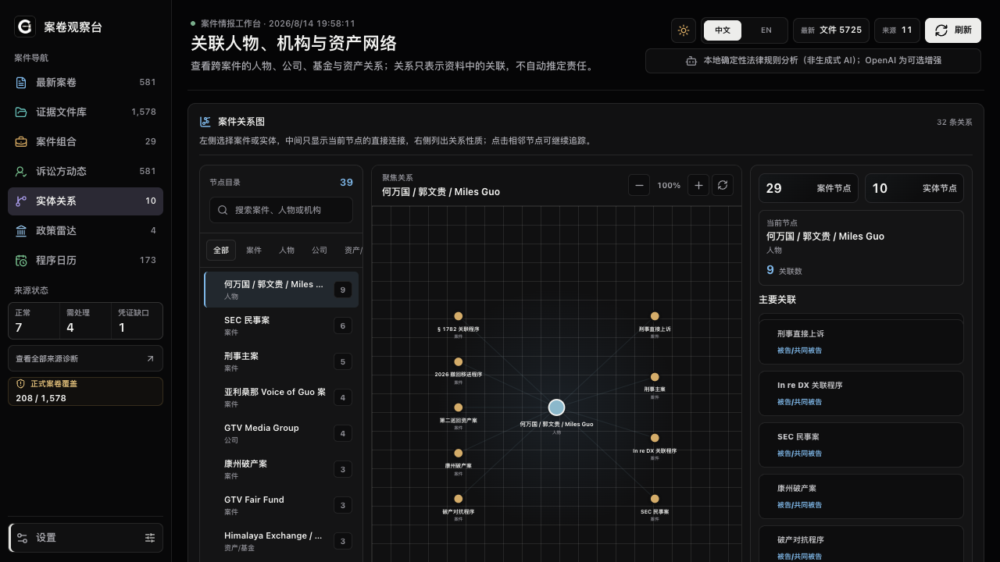
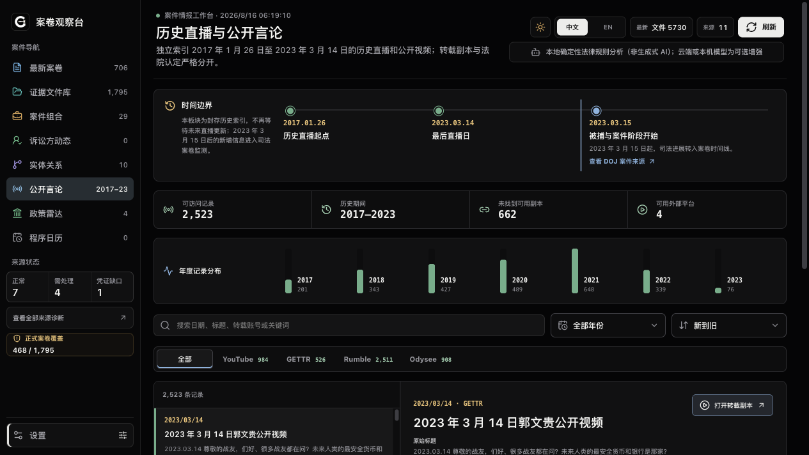
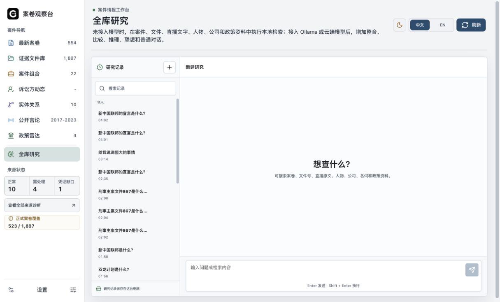
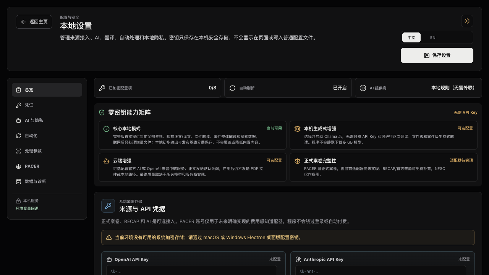

<p align="right"><a href="./README.md">中文</a> | <strong>English</strong></p>

<p align="center">
  
</p>

# Docket Observatory

<p align="center">
  A local-first research tool for U.S. court cases, regulatory matters, and historical public materials related to Guo Wengui (Miles Guo / Ho Wan Kwok).
</p>

<p align="center">
  <a href="https://github.com/Dysen177/docket-observatory/releases/latest"></a>
  <a href="https://github.com/Dysen177/docket-observatory/actions/workflows/ci.yml"></a>
  <a href="https://github.com/Dysen177/docket-observatory/blob/main/LICENSE"></a>
  <a href="https://github.com/Dysen177/docket-observatory"></a>
</p>

<p align="center">
  <a href="#download"><strong>Download v0.1.2</strong></a> ·
  <a href="./DOWNLOADS.md"><strong>Installation Guide</strong></a> ·
  <a href="./AI_SETUP.md"><strong>Ollama / API Key Guide</strong></a> ·
  <a href="#features">Features</a> ·
  <a href="#screenshots">Screenshots</a> ·
  <a href="#run-from-source">Run From Source</a>
</p>

> The app distinguishes court rulings, government allegations, party claims, and public statements. AI output is research assistance, not formal legal advice.

## Download

`v0.1.2` provides macOS and Windows desktop installers containing the current public corpus, search indexes, and 5,098 searchable bilingual transcript records.

| Computer | Installer | Size |
| --- | --- | ---: |
| Apple silicon Mac | [macOS arm64 DMG](https://github.com/Dysen177/docket-observatory/releases/download/v0.1.2/Docket-Observatory-0.1.2-macOS-arm64-unsigned.dmg) | 1.99 GB |
| Intel Mac | [macOS x64 DMG](https://github.com/Dysen177/docket-observatory/releases/download/v0.1.2/Docket-Observatory-0.1.2-macOS-x64-unsigned.dmg) | 1.99 GB |
| Windows 10/11 64-bit | [Windows x64 EXE](https://github.com/Dysen177/docket-observatory/releases/download/v0.1.2/Docket-Observatory-0.1.2-Windows-x64-unsigned.exe) | 1.92 GB |

- Check **About This Mac** if you are unsure which Mac processor you have.
- These free builds do not use paid commercial code-signing certificates. First-launch instructions and SHA-256 checks are in the [bilingual installation guide](DOWNLOADS.md) and [v0.1.2 release notes](release-notes/v0.1.2.md).

## Features

| Feature | What it does |
| --- | --- |
| Evidence library | Searches docket numbers, document numbers, people, companies, and PDF text; the main criminal docket is sorted by descending document number. |
| Docket updates | Finds new or changed public files and preserves source, filing date, and update status. |
| Bilingual reading | Shows the source, Chinese reading aid, plain-language explanation, professional details, provenance, and quality label together. |
| Historical public records | Searches 2017-2023 broadcasts, videos, public posts, and their Chinese and English transcripts. |
| GHOT text archive | Searches bilingual filing summaries, terminology, declarations, reports, and public guides. |
| Whole-library research / AI Chat | Searches locally without a model; adds cross-source synthesis, follow-up conversation, and cited answers with Ollama or a cloud model. |
| Cases and relationships | Organizes timelines and public links among cases, people, companies, funds, and bankruptcy assets. |

## Screenshots

<table>
  <tr>
    <td width="50%" valign="top"><strong>Case overview</strong><br></td>
    <td width="50%" valign="top"><strong>Evidence library</strong><br></td>
  </tr>
  <tr>
    <td width="50%" valign="top"><strong>Case groups</strong><br></td>
    <td width="50%" valign="top"><strong>People and entities</strong><br></td>
  </tr>
  <tr>
    <td width="50%" valign="top"><strong>Historical broadcasts and statements</strong><br></td>
    <td width="50%" valign="top"><strong>Whole-library research / AI Chat</strong><br></td>
  </tr>
  <tr>
    <td colspan="2" valign="top"><strong>AI and API key settings</strong><br></td>
  </tr>
</table>

## AI Modes

| No model or API key | Ollama or your own API key |
| --- | --- |
| Local full-text search, archive retrieval, existing translations, and document readings work immediately. | Adds summarization, association, cross-document synthesis, and follow-up conversation to local retrieval. |
| New files receive local text extraction, OCR, indexing, and deterministic first reads. | Can generate deeper translations and readings for new files; quality depends on the selected model. |
| No generated cross-source conclusions. | Supports OpenAI, Claude, Gemini, Ollama, and OpenAI-compatible HTTPS gateways. |

See the [illustrated Ollama and API key guide](AI_SETUP.md). Cloud text transmission is disabled by default. Original PDFs and local file paths are not sent to model providers.

## Bundled Data

- 1,924 legal records, 1,897 valid PDFs, and 1,846 content-unique PDF bodies;
- 5,152 historical broadcast, video, and public-post records, including 5,098 searchable transcripts with English coverage;
- 375 GHOT public text records, including 365 filing summaries and 7 concept or terminology records;
- bilingual overviews for 132 cases, plus translations, readings, relationships, and search indexes.

See the [v0.1.2 release notes](release-notes/v0.1.2.md) for detailed counts, quality levels, checksums, and validation results. Original PDFs, professional review, deterministic first reads, and model-generated content remain separately labeled.

## Updates And Evidence Boundaries

- Automatic updates process only new or changed files from public sources and then refresh sorting, search, and AI retrieval.
- PACER is the official federal docket source. CourtListener / RECAP is the main free public source and may not contain every filing.
- GHOT, NFSC, web archives, and third-party video platforms are secondary or contextual sources. Material conclusions should be checked against original PDFs and official dockets.
- The project does not claim access to sealed, restricted, removed, unsynchronized, or nonpublic records.

See the [network allowlist](NETWORK.md), [risk-audit summary](release-metadata/corpus-risk-audit.md), and [file-level decisions](release-metadata/corpus-review-decisions.json).

## Local-First And Security

- No user accounts, advertising, telemetry, remote database, or hidden update channel;
- API keys are encrypted locally using macOS Keychain or Windows DPAPI-backed storage;
- cloud providers receive permitted extracted text only after the user explicitly enables cloud processing;
- app updates are downloaded by the user from GitHub Releases and are never installed silently.

See the [open-source audit](OPEN_SOURCE_AUDIT.md), [security policy](SECURITY.md), and [privacy notice](PRIVACY.md).

## Run From Source

Node.js 22.12 or newer is required; Node.js 24 is recommended.

```bash
nvm use
npm ci
npm run dev:all
```

Common checks:

```bash
npm run lint
npm run build
npm run security:check
npm run test:zero-key
npm run test:search
npm run test:research-chat
```

## Feedback And Documentation

- App problems: [Bug Report](https://github.com/Dysen177/docket-observatory/issues/new?template=bug-report.yml)
- Missing sources: [Source Gap](https://github.com/Dysen177/docket-observatory/issues/new?template=source-gap.yml)
- Security vulnerabilities: [private vulnerability report](https://github.com/Dysen177/docket-observatory/security/advisories/new)
- Other contact: [poison127@protonmail.com](mailto:poison127@protonmail.com) · X [@Dysen1777](https://x.com/Dysen1777)

Source code is released under the [MIT License](LICENSE). Court records and third-party materials remain subject to their original public status, copyright, and redistribution terms.
